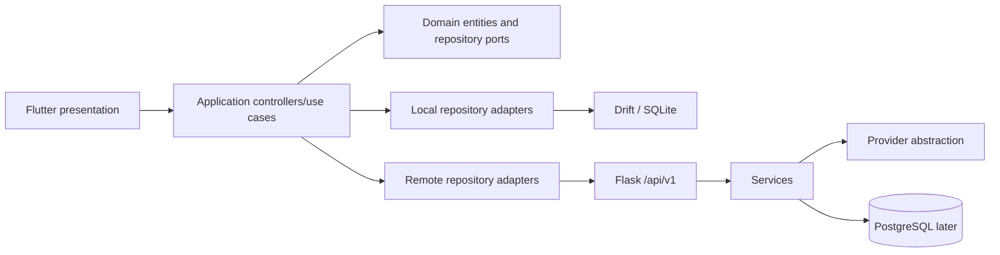

# Architecture

## Shape and dependency direction

The planned Flutter client is Android-first and iOS-ready, local-first, using Riverpod for application state/DI, GoRouter for navigation, and Drift/SQLite for local persistence. It is feature-first Clean Architecture: presentation depends on application/domain; application depends on domain; data/infrastructure implements domain repository ports. Domain depends on neither Flutter nor database/network libraries.

`lib/app/` owns bootstrap, routing, theme, localization, and config; `lib/core/` owns replaceable cross-cutting adapters (database, networking, storage, notifications, security, logging); `lib/features/<feature>/` owns domain, data, application, and presentation slices; `lib/shared/` holds only genuinely cross-feature design-system/widgets. Complex features use `domain/{entities,repositories,usecases}`, `data/{models,datasources,repositories}`, `application/{providers,controllers}`, and `presentation/{pages,widgets,state}`.

The later Flask backend uses versioned REST routes, with API, services, repositories, models, schemas, auth, AI, billing, extensions, and common concerns separated. SQLAlchemy/PostgreSQL are backend persistence concerns; Alembic migrations are introduced only in Phase 2.

## Local-first and ownership

The device owns the user's local documents, structured analysis, corrections, tasks, and reminder schedule. Original files remain local by default. The backend temporarily processes uploads and returns validated structured output; permanent server originals are not required for V1. Remote identity, quota, and sync are future bounded contexts, not prerequisites for core local use.

Assistant operations are also local-first. The client sends a minimum scoped context envelope for a question or reply draft: its `client_document_id`, validated local analysis, and only the source text/evidence and conversation turns needed for that operation. The backend processes that request context temporarily under the retention policy; it does not resolve the client ID to a permanent server document or require an account/cloud sync. A future sync service may map a local document to a `server_resource_id`, but that is an optional infrastructure capability and does not change the domain model or MVP assistant contract.

No bidirectional sync protocol is defined yet. If introduced, local entities need stable client-generated IDs, `created_at`, `updated_at`, deletion tombstones, revision/version metadata, and explicit conflict rules; sync must not silently overwrite user corrections.

## Responsibility boundaries

Client: capture/import, encrypted-at-rest evaluation, local storage, offline views, local reminders, rendering localized content, classification acceptance/correction, and construction of minimum assistant context. Backend: provider credentials, upload/request-context validation and temporary lifecycle, AI routing/prompts/schema validation, quotas, abuse controls, normalized errors, cost records, remote config, and future account/sync/billing. Flutter receives product operations, never provider credentials or provider/model names.

Infrastructure and repository implementations are replaceable via ports. Hosting is deliberately unspecified.
