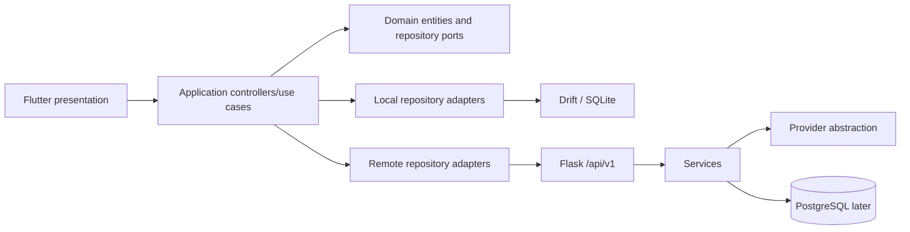

# Architecture

## System topology and dependency direction

Doxary is a mobile-first Flutter client paired with a backend service. The client owns local user-facing use cases and local data; the backend owns remote processing and server concerns. Detailed application behavior, API contracts, and AI processing are documented in their respective domains.

## Ownership and infrastructure boundaries

Flutter and backend communicate only through the documented integration boundary. The backend does not imply ownership of a user's local originals or local application state. Infrastructure adapters remain replaceable, and hosting is deliberately unspecified.

See [Application logic](app-logic/README.md), [App/backend integration](app-backend/README.md), and [AI](ai/README.md) for the corresponding current specifications.
