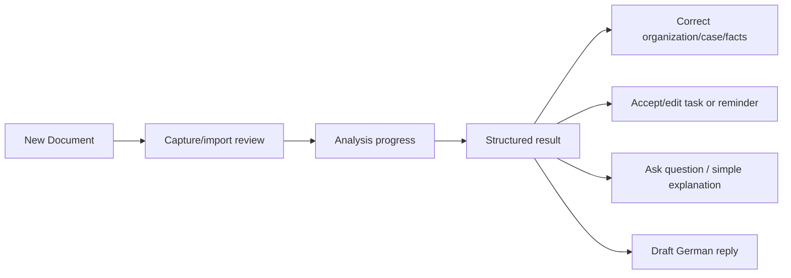

# Navigation and UX foundation

Primary bottom navigation is **Home**, **Documents**, central **New Document**, **Tasks**, and **Profile**. The central action opens camera, image import, or PDF import. Deep links are reserved for future document, case, task, and notification routes; they must validate authorization/local availability before displaying content.

Home emphasizes the import action, upcoming deadlines/tasks, and a bounded recent-documents preview (currently five). Documents is the complete local library and browses Organization -> Case -> Documents, with unclassified documents in a separate section; filters/search are added progressively. Tasks has simple Today, Upcoming, and Completed tabs. Profile owns language, privacy, notification, and future account/billing settings.

The result starts with sender suggestion, document type, plain explanation, action requirement, deadlines, appointments, amounts, requested documents, next actions, and quality/uncertainty guidance. Suggestions remain suggestions until a user confirms them. Pending analysis states are uploading, accepted, and processing; terminal technical failure and an `unavailable` AnalysisResult are distinct. Offline views show locally persisted results and a clear pending-analysis state; never imply that analysis completed offline.

The import review places a compact analysis-language selector beside the Analyze action. It controls generated explanation language (Arabic or Einfaches Deutsch) independently from the app interface language and persists locally.

### Processing UX

Processing is a user-facing staged timeline, not a raw technical log. A stage has an active and completed label (for example, Arabic `جاري رفع المستند` -> `تم رفع المستند`, then `جاري تحليل المستند` -> `تم تحليل المستند`); wireframes may show both as notation, while production shows only the label matching the current state. The client never invents percentage progress or backend sub-stages that cannot be derived from a real client/server state. Leaving this screen does not cancel analysis: the Document remains visible in Documents as processing. If completion arrives while Processing is open, navigation proceeds to Result. A completion notification is a launch requirement only when notification behavior is explicitly implemented and tested.

### Import submission UX

Analyze captures an immutable submission snapshot. Selected-file presentation is cleared or locked immediately when submission begins, and repeated taps cannot create duplicate logical analyses. The snapshot and existing idempotency lifecycle remain local integration concerns; this does not change the API contract.

### Result UX

Important facts are rendered from returned meaningful values only. The schema may support a broad fact catalog, but the UI does not create empty rows such as “amount: unknown” or “deadline: uncertain”. Organization and Case/Vorgang (`المعاملة`) are organizational metadata and may explicitly show an unassigned state; meaningful uncertainty appears as review guidance, not artificial fact values. The hierarchy is title -> summary -> required action -> relevant facts -> classification -> expandable details -> original document.

Documents uses real local routes: `/documents/organization/:organizationId`, `/documents/organization/:organizationId/case/:caseId`, and `/documents/:clientDocumentId`. An organization view lists its cases and documents directly associated with it; a case view lists its documents. Unclassified documents remain directly available. The detail route presents title and confirmed/suggested classification before original local metadata and analysis. Suggestions are confirmed or changed explicitly; they never classify automatically. Original opening remains deferred because a maintained permission-aware PDF/image adapter is not yet justified.

## Phase 2.6.3 screen-design brief

The following designs must be reviewed and approved before their implementation. Every row specifies the primary goal and hierarchy; each also defines primary/secondary actions, navigation entry/exit, loading/empty/failure states, local/offline behavior, partial-analysis treatment where applicable, German and Arabic RTL presentation, and accessibility semantics, order, dynamic type, contrast, and touch targets.

| Screen | Primary goal and information hierarchy | Key actions and navigation |
|---|---|---|
| Home | Re-enter the app and see the most actionable local work: urgent tasks, pending/failed analysis, then recents. | Import is primary; Documents, Tasks, and a relevant document are secondary entries. Empty state directs to import; local data remains available offline. |
| Add / Import | Select and review one logical local Document, its files/order, and explanation language. | Start analysis or cancel; after start, transient selected files are cleared or locked to prevent duplicate submission. Picker/error/cancellation states preserve local work. |
| Processing | Explain upload, accepted, and processing without implying completion. | View document or safely leave; terminal failure offers a deliberate new retry, never automatic resubmission. Pending local operation resumes offline/restart appropriately. |
| Documents | Browse the complete local library by confirmed Organization, then unclassified. | Open Organization, Document, or import. Loading/empty/error preserve accessible local navigation and Arabic RTL grouping. |
| Organization | Understand one confirmed organization: cases first, then documents without a case. | Open Case/Document; return to Documents. Empty state distinguishes no cases from no documents. |
| Case / Vorgang / المعاملة | Follow documents belonging to one continuing matter. | Open Document; return to Organization. Empty and error states retain ownership context. |
| Document Detail | Understand a local document: title, confirmed classification, unresolved suggestion, date, original, then analysis state. | Confirm/change classification, open original when supported, open result; offline reads local data only. |
| Analysis Result | Understand the structured result: explanation, actions, dates, amounts, evidence/uncertainty. | Return to detail and correct classification; partial/unavailable results remain explicit valid outcomes. |
| Classification confirm/change | Promote or correct suggestions without conflating them with facts. | Confirm, select/create Organization and organization-owned Case, clear Case, or cancel. Arabic uses المعاملة for Case; focus order follows direction. |
| Tasks | Review actionable work by time/status. | Open source context and update task state; remains unimplemented until an approved design is implemented. |
| Profile | Manage local language, privacy, and future settings. | Change local preferences; account, quotas, and billing remain unimplemented. |

For all analysis-related screens, German labels and Arabic RTL layouts are equally reviewed. Loading, empty, failure, local-only, and partial-analysis states are first-class designs rather than edge cases.

## Phase 1 implementation

GoRouter uses a stateful indexed shell for Home, Documents, New Document, Tasks, and Profile, preserving each tab branch where practical. Central route constants define the five paths and reserve nested document, case/task, import-review, and analysis paths. Home renders its real local repository streams with empty/loading/error states; it does not inject sample document data. The import screen offers camera, image or PDF intent choices but truthfully reports the unavailable picker capability instead of simulating an import. On cold start, Arabic device locales select Arabic UI; all other locales select German unless the user has saved an explicit UI preference.
