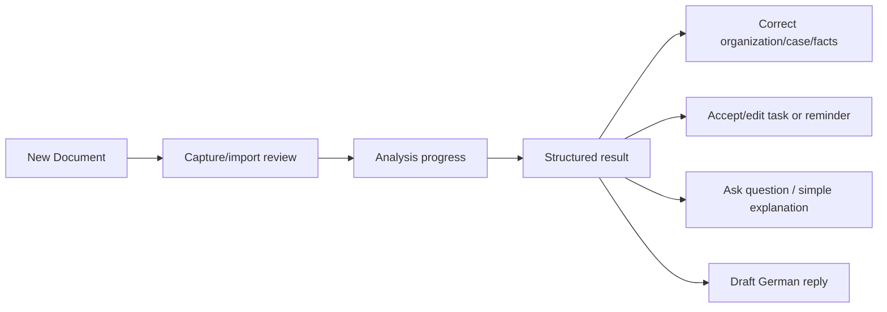

# Navigation and UX foundation

Primary bottom navigation is **Home**, **Documents**, central **New Document**, **Tasks**, and **Profile**. The central action opens camera, image import, or PDF import. Deep links are reserved for future document, case, task, and notification routes; they must validate authorization/local availability before displaying content.

Home emphasizes the import action, upcoming deadlines/tasks, and recent documents. Documents browses Organization -> Case -> Documents with filters/search added progressively. Tasks has simple Today, Upcoming, and Completed tabs. Profile owns language, privacy, notification, and future account/billing settings.

The result starts with sender suggestion, document type, plain explanation, action requirement, deadlines, appointments, amounts, requested documents, next actions, and quality/uncertainty guidance. Suggestions remain suggestions until a user confirms them. Pending analysis states are uploading, accepted, and processing; terminal technical failure and an `unavailable` AnalysisResult are distinct. Offline views show locally persisted results and a clear pending-analysis state; never imply that analysis completed offline.

The import review places a compact analysis-language selector beside the Analyze action. It controls generated explanation language (Arabic or Einfaches Deutsch) independently from the app interface language and persists locally.

An analyzed document opens its `/documents/:clientDocumentId` result route. That route reads the latest local Drift analysis and never requires a network request merely to reopen an existing result. Optional sections are omitted when absent; partial and unavailable are rendered as valid analysis outcomes.

## Phase 1 implementation

GoRouter uses a stateful indexed shell for Home, Documents, New Document, Tasks, and Profile, preserving each tab branch where practical. Central route constants define the five paths and reserve nested document, case/task, import-review, and analysis paths. Home renders its real local repository streams with empty/loading/error states; it does not inject sample document data. The import screen offers camera, image or PDF intent choices but truthfully reports the unavailable picker capability instead of simulating an import. On cold start, Arabic device locales select Arabic UI; all other locales select German unless the user has saved an explicit UI preference.
