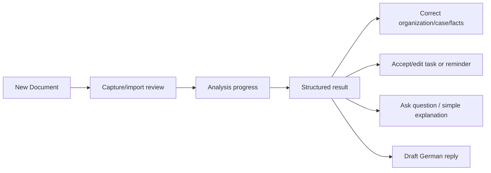

# Navigation and UX foundation

Primary bottom navigation is **Home**, **Documents**, central **New Document**, **Tasks**, and **Profile**. The central action opens camera, image import, or PDF import. Deep links are reserved for future document, case, task, and notification routes; they must validate authorization/local availability before displaying content.

Home emphasizes the import action, upcoming deadlines/tasks, and recent documents. Documents browses Organization -> Case -> Documents with filters/search added progressively. Tasks has simple Today, Upcoming, and Completed tabs. Profile owns language, privacy, notification, and future account/billing settings.

The result starts with sender, what it is, plain explanation, action requirement, due date, and next action. Original German text is accessible but secondary. Multiple practical states can appear together. Offline views show local information and a clear pending-analysis state; never imply that analysis completed offline.

## Phase 1 implementation

GoRouter uses a stateful indexed shell for Home, Documents, New Document, Tasks, and Profile, preserving each tab branch where practical. Central route constants define the five paths and reserve nested document, case/task, import-review, and analysis paths. Home renders its real local repository streams with empty/loading/error states; it does not inject sample document data. The import screen offers camera, image, and PDF intent choices but truthfully reports the unavailable picker capability instead of simulating an import.
