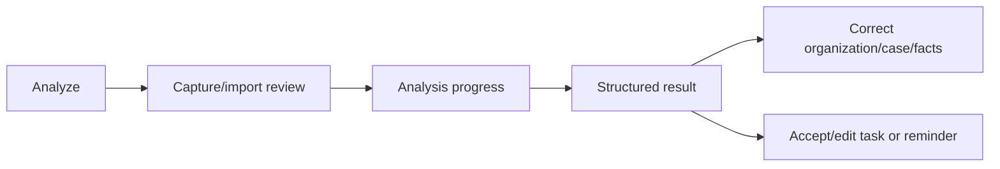

# Navigation and UX foundation

## Primary navigation

The primary destinations are **Home**, **Documents**, central **Analyze**, **Tasks**, and **Settings**. Analyze expresses the user’s intent to understand a document; camera capture and file import are steps inside that flow, not a separate primary destination. Settings owns profile/account functionality; Profile is not a separate bottom-navigation destination.

Primary bottom navigation is visible only on those five primary roots. Deep links are reserved for future document, case, task, and notification destinations and must not bypass the app’s normal access and availability checks.

## Focused and nested flows

Focused or nested flows hide primary bottom navigation and provide explicit Back or Close controls. This includes camera capture/review, Processing, the state-driven Document route, Organization, Case (`المعاملة`), Unclassified Documents, classification edit/select/create, Organization/Case selection or creation, Create/Edit Task, and comparable transactional or modal flows. Where practical, Back returns to the actual origin while preserving its prior UI state.

The Document route is one lifecycle-driven destination rather than a redundant Detail-then-Result navigation layer. Its presentation changes with the Document’s user-visible state: pre-analysis, processing, complete, partial/uncertain, and failed/unavailable.

## Entry and exit rules

The current core navigation flow is:

Analyze enters capture/import review. Review enters Processing only after the user starts analysis. Processing can be safely left without cancelling the work. Completion proceeds to the Result presentation when that flow is active. Result can enter classification correction or task/reminder work. Focused flows return with Back/Close rather than exposing primary navigation.

## Documents hierarchy

Documents is the complete local library and browses Organization → Case → Document. Unclassified documents remain in a separate section. An Organization owns its Cases and documents without a Case. A Case is always under an Organization.

Unclassified and Without Case are distinct UI states: an Unclassified Document has no confirmed Organization; Without Case has a confirmed Organization but no Case. Case is consistently `المعاملة` in Arabic.

## Primary destination roles

- **Home** is an actionable overview, not a second Documents library.
- **Documents** is the complete local library and supports contextual library navigation.
- **Analyze** is the document-understanding entry point, including camera/file review and explanation-language choice.
- **Tasks** uses Today, Upcoming, and Completed views.
- **Settings** owns language, privacy, notifications, appearance, profile/account, legal, and about functionality.

## Deferred assistant UI

Approved current navigation does not include Assistant/Chat or German-reply-drafting screens. Their future UI is not defined here.

Screen purposes and states are defined in [Screens](SCREENS.md). User actions within those flows are defined in [Interactions](INTERACTIONS.md).
