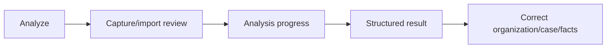

# Navigation and UX foundation

## Primary navigation

The primary destinations are **Home**, **Documents**, central **Analyze**, **Tasks**, and **Settings**. Analyze expresses the user’s intent to understand a document; camera capture and file import are steps inside that flow, not a separate primary destination. Settings owns profile/account functionality; Profile is not a separate bottom-navigation destination.

Primary bottom navigation is visible only on those five primary roots. Public deep links are reserved and must not bypass the app’s normal access and availability checks. A local Task reminder tap is an app-owned intent: an extant Task opens the established `/tasks/:taskId` Task Detail route; a missing Task returns to `/tasks` with one localized informational dialog.

## Focused and nested flows

**Current implementation status:** Camera capture/review, Processing, the state-driven Document route, Organization, Case, Unclassified Documents, classification correction, and Create/Edit Task are current focused flows. Organization/Case selection and creation are nested focused contextual sheets/modals, not standalone primary destinations. Create Task is reachable at `/tasks/create`; Edit Task is reachable at `/tasks/edit/:taskId`.

Focused or nested flows hide primary bottom navigation and provide explicit Back or Close controls. This includes camera capture/review, Processing, the state-driven Document route, Organization, Case (`المعاملة`), Unclassified Documents, classification edit/select/create, Organization/Case selection or creation, Create/Edit Task, and comparable transactional or modal flows. Where practical, Back returns to the actual origin while preserving its prior UI state.

The Document route is one lifecycle-driven destination rather than a redundant Detail-then-Result navigation layer. Its presentation changes with the Document’s user-visible state: pre-analysis, processing, complete, partial/uncertain, and failed/unavailable.

## Entry and exit rules

The implemented core navigation flow is:

Analyze enters capture/import review. Review enters Processing only after the user starts analysis. Processing can be safely left without cancelling the work. Completion proceeds to the Result presentation when that flow is active. Result can enter classification correction. Focused flows return with Back/Close rather than exposing primary navigation.

Result can open contextual Create Task for a confirmed action-required result. It appears only for meaningful action, deadline, appointment, suggested-task, or next-action context, retains the linked Document, derives Organization/Case context when available, and creates a Task only after explicit Save. Reminder delivery remains an outstanding MVP gap.

## Deferred navigation and back-stack audit

Physical-device validation found that Android system Back can close Doxary from an Analysis/Document-related surface instead of returning to the expected in-app destination. This is a deferred navigation/back-stack gap; do not mask it with an exit prompt before route history is audited.

After the Settings phase, audit the complete navigation flow and verify that Back returns to a logical in-app destination across Home, Documents, Document Detail, Analysis Result/related surfaces, Needs Attention, Tasks, Task Detail, Create/Edit Task, Analyze/import, Settings, nested focused routes, notification-origin and cold-start navigation, bottom-navigation roots, app-bar Back, Android system Back, and pushed/deep routes. Fix route-history semantics where required.

When Android system Back would genuinely leave the application from a root, evaluate a localized exit confirmation. Show it only when no valid in-app destination remains; never use it instead of fixing broken route history or show it during ordinary in-app Back navigation.

Intended sequencing: NOW proceed with Settings work. DURING its information-architecture review, decide whether and where to expose Analysis History/Activity. AFTER Settings, perform the global navigation/back-stack audit and correct Android Back behavior. Only after route history is correct, decide whether to implement root exit confirmation. Permanent failed/deleted Analysis-history removal follows once its lifecycle and privacy consequences are finalized; see [Application Logic](../app-logic/APPLICATION_LOGIC.md#document-lifecycle).

## Documents hierarchy

Documents is the complete local library and browses Organization → Case → Document. Unclassified and Needs Attention remain separate special collections; the latter is a focused filtered route under Documents, not a bottom-navigation destination. Home opens that route directly from its count/link. An Organization owns its Cases and documents without a Case. A Case is always under an Organization.

Unclassified and Without Case are distinct UI states: an Unclassified Document has no confirmed Organization; Without Case has a confirmed Organization but no Case. Case is consistently `المعاملة` in Arabic.

## Primary destination roles

- **Home** is an actionable overview, not a second Documents library.
- **Documents** is the complete local library and supports contextual library navigation.
- **Analyze** is the document-understanding entry point, including camera/file review and explanation-language choice.
- **Tasks** currently provides Today, Upcoming, Overdue, and Completed bucket views, completion/reopening, focused Create/Edit Task flows, local timed/All Day reminder delivery after save, and Task reminder taps to the existing Task Detail route. Full Settings notification controls remain deferred.
- Task reminder responses are retained until the router shell is ready. Cold-start launch details and running/background callbacks enter the same typed local intent flow; duplicate pending intents are coalesced. The local Task repository determines whether to open Task Detail or fall back to Tasks with the unavailable-Task dialog. Completed Tasks remain valid destinations. See [Application Logic](../app-logic/APPLICATION_LOGIC.md#local-task-reminder-scheduling) for response ownership and payload constraints.
- **Settings** currently provides app-language selection; its remaining approved sections are visible pre-release implementation gaps and are currently unavailable/non-navigating. Before public launch, each visible capability must become functional or be removed through an explicit product decision; the current direction is to implement them.

## Deferred assistant UI

Approved current navigation does not include Assistant/Chat or German-reply-drafting screens. Their future UI is not defined here.

## Documents special entries

Unclassified and Without Case remain distinct navigation states: Unclassified has no confirmed Organization, while Without Case has a confirmed Organization but no Case. They use special folder-like entries and are never represented as Organization or Case records.

Organization, Without Case, and Case are focused nested archive flows: each provides an explicit Back/Close control and keeps primary bottom navigation hidden while preserving the practical origin state on return.

Screen purposes and states are defined in [Screens](SCREENS.md). User actions within those flows are defined in [Interactions](INTERACTIONS.md).
